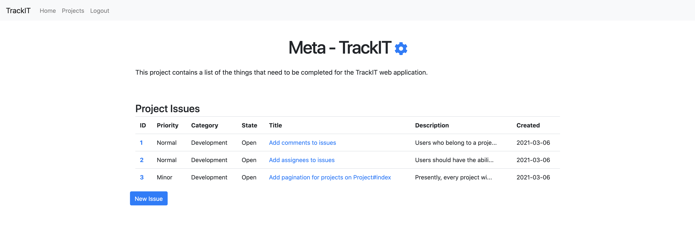

# TrackIT

TrackIT is a free and open source issue tracker built with Ruby on Rails,
currently hosted on Heroku at https://trackit-software.herokuapp.com/

Currently, TrackIT provides you with the ability to create/edit projects, issues,
and accept/reject requests from other users to join your projects.

## Example Project
Here, you can see a project on TrackIT where users can view existing issues.

